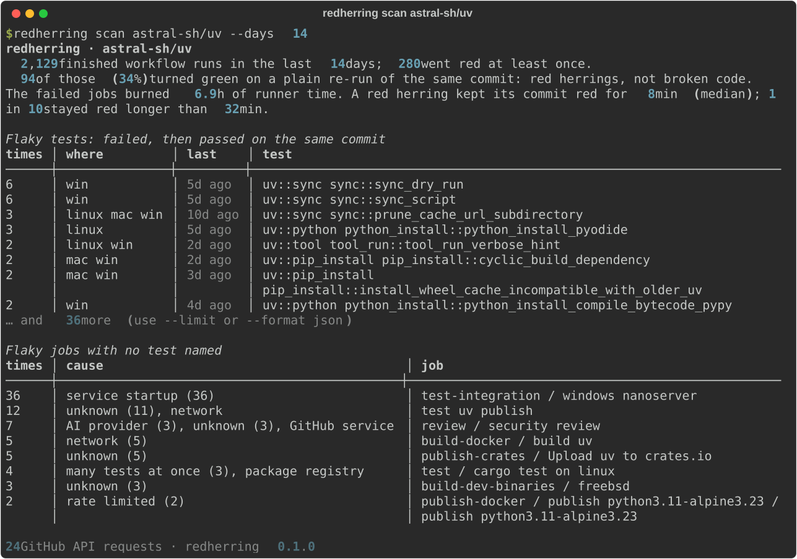
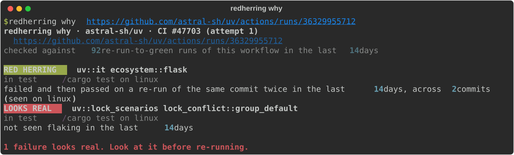

# redherring

**Find the CI failures that weren't your fault.**

redherring reads the GitHub Actions history your repo already has and finds every run that went red, then turned green when someone re-ran the *same commit*. Nothing in the code changed between those two attempts, so whatever failed first was not caused by the commit: a flaky test, a network blip, a package registry hiccup, a runner that vanished. redherring opens the failed logs, names the tests (19 test-runner formats) or the infrastructure cause, and ranks them.

Then, when a build fails, `redherring why` tells you (or your coding agent) which failures are known red herrings and which ones look real.

No server, no signup, nothing to install in CI first. If your repo has Actions history, the first run already has answers.



*Real output for a public repo, 28 September 2026. The "AI provider" cause is an AI code-review job failing with "Selected model is at capacity".*

## Install

redherring is a Python 3.11+ command-line tool. With [uv](https://docs.astral.sh/uv/):

```sh
uvx --from git+https://github.com/ixklo/redherring redherring scan OWNER/REPO
```

or `pipx install git+https://github.com/ixklo/redherring`.

It needs a GitHub token to read Actions logs. If you use the [GitHub CLI](https://cli.github.com/), it borrows `gh auth token` automatically; otherwise set `GH_TOKEN`. Any token works for public repositories; private ones need `actions: read`.

## `redherring scan`: what flakes in this repo?

```sh
redherring scan                       # the repo of the current checkout
redherring scan vitejs/vite --days 14
redherring scan owner/repo --workflow ci.yml --format md > FLAKY.md
```

You get:

- **Flaky tests**: each failed and then passed on a re-run of the same commit, with how often, on how many commits, on which OS (plenty of tests only flake on Windows), and when last seen.
- **Flaky jobs with no test named**, grouped by cause: `network`, `package registry`, `rate limited`, `runner lost`, `job timeout`, `out of memory`, `disk full`, `service startup`, `GitHub service`, `AI provider`, `many tests at once` (an environment problem, not ten flaky tests), or `unknown`.
- **What it cost**: runner time burned by the failed jobs, and how long commits sat red waiting for someone to press re-run.

`--format json` gives everything, including example job links, for your own dashboards.

## `redherring why`: is this failure mine?

```sh
redherring why https://github.com/owner/repo/actions/runs/123456789
redherring why 123456789 --repo owner/repo --format json
```



For every failure in the run, one verdict:

| verdict | meaning |
|---|---|
| **RED HERRING** (known flaky) | This test failed and then passed on a re-run of the same commit in the last N days. |
| **RED HERRING** (infrastructure) | The log shows a network, registry, runner, or service problem, not a test failure. |
| **NOT THIS CHANGE** | The latest finished run on the default branch fails this same test. |
| **LOOKS REAL** | Never seen flaking, no infrastructure cause. Probably your change. |
| **UNCLEAR** / **POLICY CHECK** | Can't tell from history, or a PR policy check (labels, linked issue) that passes once the PR is updated. |

Exit codes make it scriptable: `0` all red herrings (or nothing failed), `1` something looks real, `3` unclear, `2` error.

```sh
redherring why "$RUN" -q && gh run rerun "$RUN" --failed
```

### For coding agents

Agents lose a lot of time "fixing" failures that were never theirs, and sometimes weaken a perfectly good test to make a flake go green. Add this to your `AGENTS.md` or `CLAUDE.md`:

```markdown
## CI failures
Before changing code because CI failed, run `redherring why <run-url> --format json`.
- `recommendation: "rerun"`: every failure is a known flake, an infrastructure problem, or already
  failing on main. Re-run the failed jobs (`gh run rerun <id> --failed`); don't edit code or tests for it.
- `recommendation: "investigate"`: fix only the findings with `"red_herring": false`.
- Never skip, loosen, or delete a test just because it is listed as flaky.
```

## GitHub Action

Explain every failed CI run in its job summary:

```yaml
# .github/workflows/redherring.yml
name: redherring
on:
  workflow_run:
    workflows: [CI]          # the name of your test workflow
    types: [completed]
permissions:
  actions: read
  contents: read
jobs:
  why:
    if: github.event.workflow_run.conclusion == 'failure'
    runs-on: ubuntu-latest
    steps:
      - uses: ixklo/redherring@v0.1.0
```

Or post a weekly flaky-test report:

```yaml
on:
  schedule: [{ cron: "0 7 * * 1" }]
permissions:
  actions: read
jobs:
  scan:
    runs-on: ubuntu-latest
    steps:
      - uses: ixklo/redherring@v0.1.0
        with:
          command: scan
          days: "30"
```

Inputs: `command` (`why` or `scan`), `run-id`, `days`, `workflow`, `ledger`, `fail-on-real`, `github-token`. Output: `recommendation`.

## Keep your flake history: the ledger

From 1 October 2026 GitHub deletes workflow runs once they pass your log-retention period (90 days by default). Past that, redherring has nothing to read. A ledger keeps the evidence:

```sh
redherring scan --ledger .github/flake-ledger.json          # merges new evidence into the file
redherring why "$RUN" --ledger .github/flake-ledger.json    # uses it as extra history
```

The file is small JSON (one entry per failed job: test names, cause, commit, OS, link). Keep it anywhere durable. You can commit it, or carry it between scheduled runs with `actions/cache`:

```yaml
    steps:
      - uses: actions/cache@v6
        with:
          path: flake-ledger.json
          key: redherring-ledger-${{ github.run_id }}
          restore-keys: redherring-ledger-
      - uses: ixklo/redherring@v0.1.0
        with:
          command: scan
          ledger: flake-ledger.json
```

Entries older than a year are dropped (`--keep-days`).

## How it decides

redherring is deliberately strict about what it calls flaky. **Only one kind of evidence counts: the same commit failed and then passed.** That is what a re-run is. It does not guess from "failed on a PR, passed on main" or "this test fails a lot", because those are often real failures. A tool that cries wolf is worse than none.

Then, per failed job:

1. **Tests.** The log is cleaned (timestamps, colour codes) and read by runner-specific parsers. Test ids keep only stable parts (file, suite, name; never line numbers or timings) so the same test lines up across commits and OSes.
2. **Infrastructure.** If no test is named, the end of the log is matched against specific signatures (`ECONNRESET`, `Could not transfer artifact`, `The runner has received a shutdown signal`, `model is at capacity`, ...).
3. **Not flakiness at all.** Roll-up jobs ("all required jobs passed") and PR policy checks are set aside and not counted.

Supported test output:

| ecosystem | runners |
|---|---|
| Python | pytest (incl. xdist, pytest-rerunfailures), unittest |
| JavaScript / TypeScript | Jest, Vitest, Playwright (incl. its own retries), Mocha, node:test, Bun, TAP (QUnit/testem) |
| Go | `go test`, gotestsum, test timeouts |
| Rust | `cargo test`, cargo-nextest (incl. retries) |
| Ruby | RSpec, Minitest |
| JVM | Maven Surefire, Gradle |
| others | PHPUnit, .NET (`dotnet test`), CTest, XCTest, ExUnit |

Missing yours? A parser is one function and a test with a real log excerpt. See [CONTRIBUTING.md](CONTRIBUTING.md).

## Limits, honestly

- **History has an expiry date.** Job logs are kept for 90 days by default, and [from 1 October 2026](https://github.blog/changelog/2026-08-27-actions-retention-will-cover-checks-workflow-runs-and-statuses/) GitHub deletes the workflow runs themselves once they pass the repo's log retention period (90 days by default, and at most 90 days for public repos). `--days` beyond that finds nothing; use a [ledger](#keep-your-flake-history-the-ledger) to keep what was found.
- **Only re-runs count.** Repos that never press re-run, or retry inside the job without reporting it, show fewer flakes than they have. Playwright, nextest and pytest-rerunfailures retries are recognised when they appear in a failed job's log.
- **Big repos cost API requests.** A busy monorepo can take a few thousand requests for 30 days. redherring waits out rate limits on its own, and caches everything immutable (attempt job lists, logs) so later runs only fetch what's new.
- **GitHub Actions only**, for now.

## Privacy

redherring runs on your machine (or in your own Actions runner) and talks only to the GitHub API. Downloaded logs are cached, compressed, in your user cache folder (`%LOCALAPPDATA%\redherring`, `~/Library/Caches/redherring`, or `~/.cache/redherring`; override with `REDHERRING_CACHE`). Nothing is sent anywhere else.

## License

MIT
