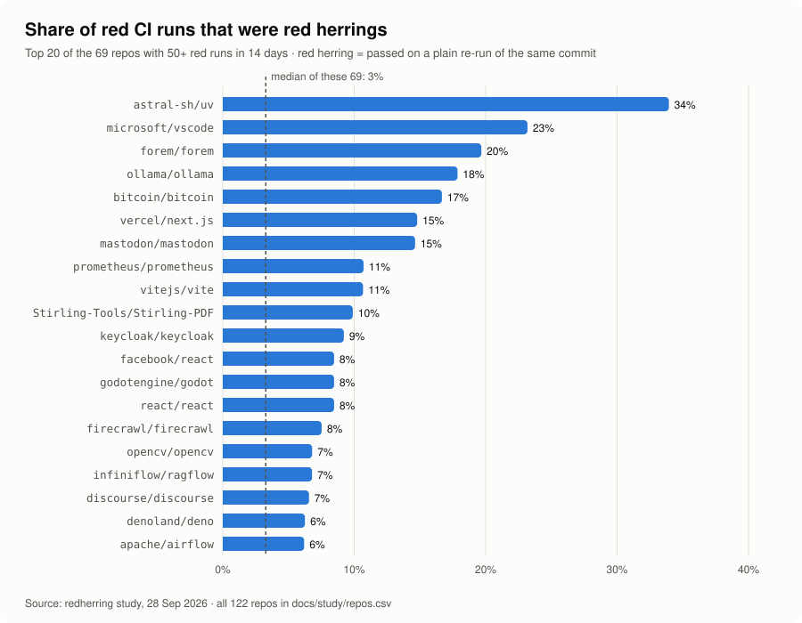

# Red herrings in open-source CI

*A study of 122 popular GitHub repositories, 14 days of GitHub Actions history each, measured with redherring on 28 September 2026.*

A **red herring** here is a workflow run that went red and then turned green when someone re-ran **the same commit**. Nothing in the code changed between the two attempts, so the first failure wasn't caused by the commit.

## Headline

- 122 repos, **1,246,451** finished workflow runs, **85,608** of which went red.
- **3,078 (3.6%)** of the red runs turned green on a plain re-run.
- **It's concentrated.** The median repo is at about **2%**. A quarter of repos are at **7% or more**, and some are far higher: astral-sh/uv 34%, microsoft/vscode 23%, vercel/next.js 15%, mastodon/mastodon 15%, prometheus/prometheus 11%.
- The failed jobs of those runs used **690 runner-hours** in two weeks.
- **47 tests failed repeatedly on Windows and nowhere else.**
- One AI-agent project, openclaw/openclaw, ran 676,065 workflow runs in the two weeks, more than half of the whole study.

<p align="center">
  <picture>
    <source media="(prefers-color-scheme: dark)" srcset="share-dark.svg">
    
  </picture>
</p>

## Method

- **Sample.** The 10 most-starred repositories per language (Python, TypeScript, JavaScript, Go, Rust, Java, C++, C#, Ruby, PHP, Kotlin, Swift) with at least 10,000 stars, updated since 14 September 2026 and with at least 100 Actions runs in the window, plus 25 hand-picked repos from an earlier field test. 122 were measured; 18 ran out of time (GitHub allows 5,000 API requests an hour, and the busiest repos need thousands). They're listed at the end. The missing ones are mostly the busiest repos, so the totals (runs, runner-hours) undercount; the shares describe the repos that were measured.
- **Evidence.** `redherring scan OWNER/REPO --days 14 --format json`. A run counts only if an earlier attempt failed and the final attempt of the **same run** passed. Runs that ended red, and runs re-run after being cancelled, are not red herrings.
- **Classification.** Each failed job's log is read: named failing tests (20+ runner formats), else an infrastructure cause (network, registry, rate limits, runners, GitHub services, AI providers...), else roll-up jobs and PR policy checks (excluded), else "unknown". All jobs were re-classified at the end with the final parsers.
- **Only public data.** Repository names, job names, test names and counts. No people: no authors, emails or usernames.

## Results

| cause of the red-herring job | jobs | share |
|---|--:|--:|
| unknown | 2,313 | 45.6% |
| flaky tests | 1,508 | 29.7% |
| network | 473 | 9.3% |
| rate limited | 161 | 3.2% |
| job timeout | 110 | 2.2% |
| package registry | 91 | 1.8% |
| GitHub service | 87 | 1.7% |
| log expired | 69 | 1.4% |
| runner environment | 69 | 1.4% |
| service startup | 66 | 1.3% |
| runner lost | 53 | 1.0% |
| many tests at once | 48 | 0.9% |
| disk full | 14 | 0.3% |
| AI provider | 5 | 0.1% |
| out of memory | 5 | 0.1% |
| test worker crash | 4 | 0.1% |

| language | repos | went red | red herrings | share |
|---|--:|--:|--:|--:|
| TypeScript | 13 | 35,487 | 1,707 | 5% |
| Python | 15 | 31,574 | 501 | 2% |
| JavaScript | 9 | 2,358 | 293 | 12% |
| Rust | 11 | 5,708 | 149 | 3% |
| Java | 12 | 2,465 | 145 | 6% |
| Go | 13 | 1,516 | 79 | 5% |
| Ruby | 7 | 856 | 67 | 8% |
| C++ | 8 | 3,578 | 47 | 1% |
| Swift | 9 | 691 | 31 | 4% |
| PHP | 7 | 625 | 22 | 4% |
| C# | 8 | 321 | 19 | 6% |
| Kotlin | 10 | 429 | 18 | 4% |

| repo | runs | went red | red herrings | share | flaky tests | runner h | top cause |
|---|--:|--:|--:|--:|--:|--:|---|
| openclaw/openclaw | 676,065 | 20,749 | 909 | 4% | 77 | 130.0 | unknown |
| microsoft/vscode | 19,520 | 1,665 | 386 | 23% | 90 | 97.3 | flaky tests |
| NousResearch/hermes-agent | 61,951 | 24,335 | 292 | 1% | 95 | 29.9 | flaky tests |
| vercel/next.js | 18,427 | 1,859 | 275 | 15% | 235 | 114.1 | flaky tests |
| grafana/grafana | 119,324 | 5,487 | 193 | 4% | 63 | 45.0 | unknown |
| n8n-io/n8n | 63,697 | 3,301 | 121 | 4% | 106 | 25.8 | flaky tests |
| astral-sh/uv | 2,129 | 277 | 94 | 34% | 44 | 6.9 | service startup |
| Significant-Gravitas/AutoGPT | 26,640 | 1,877 | 85 | 5% | 12 | 15.6 | flaky tests |
| keycloak/keycloak | 7,159 | 836 | 77 | 9% | 26 | 21.2 | flaky tests |
| apache/airflow | 9,296 | 970 | 60 | 6% | 11 | 30.0 | flaky tests |
| Stirling-Tools/Stirling-PDF | 13,393 | 566 | 56 | 10% | 0 | 16.8 | network |
| langflow-ai/langflow | 11,091 | 916 | 43 | 5% | 11 | 30.2 | runner lost |
| langgenius/dify | 20,087 | 1,102 | 36 | 3% | 16 | 2.5 | flaky tests |
| infiniflow/ragflow | 1,797 | 486 | 33 | 7% | 4 | 9.3 | unknown |
| discourse/discourse | 7,915 | 427 | 28 | 7% | 10 | 4.2 | flaky tests |
| openai/codex | 21,793 | 3,557 | 26 | 1% | 0 | 3.3 | unknown |
| supabase/supabase | 33,138 | 1,137 | 20 | 2% | 6 | 2.5 | flaky tests |
| mastodon/mastodon | 5,883 | 123 | 18 | 15% | 6 | 1.6 | unknown |
| prometheus/prometheus | 1,556 | 168 | 18 | 11% | 33 | 5.8 | network |
| vitejs/vite | 1,053 | 150 | 16 | 11% | 15 | 1.4 | flaky tests |
| huggingface/transformers | 10,852 | 1,492 | 14 | 1% | 18 | 1.7 | flaky tests |
| bevyengine/bevy | 3,404 | 627 | 13 | 2% | 0 | 0.7 | unknown |
| steipete/CodexBar | 1,236 | 312 | 13 | 4% | 0 | 4.0 | unknown |
| utmapp/UTM | 128 | 16 | 13 | 81% | 0 | 7.2 | runner environment |
| forem/forem | 634 | 61 | 12 | 20% | 1 | 0.3 | unknown |

Per-repo numbers for all 122 repos: [`repos.csv`](repos.csv). Cause totals: [`causes.json`](causes.json).

## How accurate the classification is

Three audits, each on 53-60 **fresh** failed jobs (never an earlier audit's job names), compared redherring's reading with the raw log. The auditor was a different AI model than the one that wrote the tool. No human has checked these yet.

| | audit 1 (53 jobs) | audit 2 (60) | audit 3 (60) |
|---|---|---|---|
| Named a cause | 26 right · 4 partial · 1 wrong · 1 can't tell | 27 · 6 · 1 · 1 | 25 · 1 · 4 · 4 |
| Said "unknown" | 1 right · 8 partial · 12 wrong | 8 · 2 · 14 · 1 | 4 · 3 · 14 · 5 |

- When it names a cause it's usually right. Audit 3 still caught two false-positive bugs (4 jobs). Both are fixed, and the numbers above use the fixed code.
- Its weakness is recall. About half of the "unknown" answers had a cause a person could see in a format redherring didn't parse yet. Each round's misses were fixed, but new formats keep appearing. So the **"unknown" share (46%) overstates how much is truly unexplained**, and the "flaky tests" share understates it.

## Limitations

- **Lower bound.** Only same-commit re-runs count. Teams that push a new commit instead, or retry inside the job, show fewer red herrings than they have.
- **Two weeks, one snapshot.** Shares for small repos rest on few red runs; the per-repo share is only reported where a repo had at least 10.
- **Selection.** Popular, active repos. Not representative of private or small projects.
- **AI-built, AI-checked.** The tool, the study and the audits were produced with AI (Claude). Judge the numbers with that in mind; the method and code are here to check.

## Reproduce

```sh
uvx redherring scan OWNER/REPO --days 14 --format json > OWNER_REPO.json
```

Numbers shift over time: runs keep coming, and from 1 October 2026 GitHub deletes runs older than a repo's log retention (90 days by default).

## Not measured (18)

anomalyco/opencode, anthropics/claude-code, nodejs/node, mui/material-ui, tauri-apps/tauri, oven-sh/bun, zed-industries/zed, ggml-org/llama.cpp, electron/electron, jellyfin/jellyfin, dotnet/aspnetcore, Homebrew/brew, chatwoot/chatwoot, ruby/ruby, appwrite/appwrite, nextcloud/server, symfony/symfony, manaflow-ai/cmux

---

Data in this folder: CC BY 4.0. Code: MIT.
